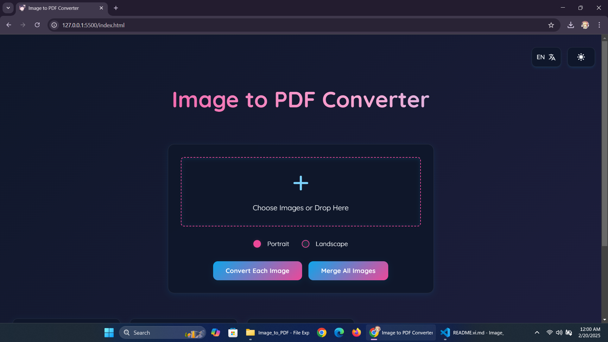
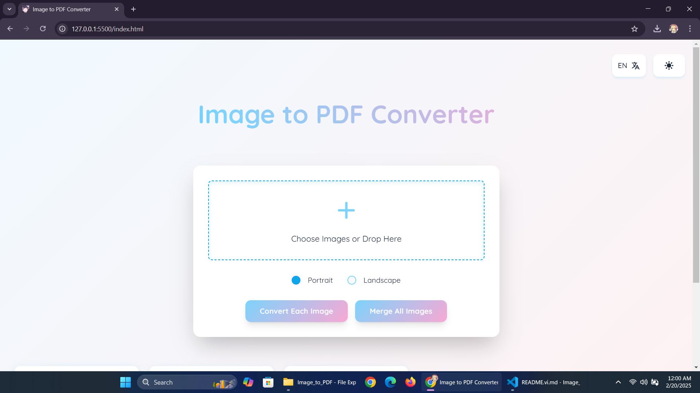

# Image to PDF Converter

A modern web application that converts images to PDF files with a beautiful glass-morphism UI design. Built with pure HTML, CSS, JavaScript and uses Tailwind CSS for styling.

[Live Demo](https://teosushi1014.github.io/image-to-pdf) | [English](./README.md) | [Tiếng Việt](./README.vi.md)

## Preview




## Features

- 🖼️ Convert single/multiple images to PDF
- 📄 Support both portrait and landscape orientations
- 🌓 Dark/Light mode support
- 🌐 Multi-language support (English/Vietnamese)
- 💫 Smooth animations and modern glass-morphism design
- 📱 Fully responsive across all devices
- 🖱️ Drag and drop support
- 🔍 Image preview before conversion

## Tech Stack

- HTML5
- CSS3 (with Glass-morphism design)
- JavaScript (ES6+)
- [Tailwind CSS](https://tailwindcss.com)
- [PDF-lib.js](https://pdf-lib.js.org)

## Getting Started

1. Clone the repository:
```bash
git clone https://github.com/TeoSushi1014/image-to-pdf.git
```

2. Open `index.html` in your browser:
```bash
cd image-to-pdf
# Use any local server, for example:
python -m http.server 8000
```

3. Visit `http://localhost:8000` in your browser

## Usage

1. Click the upload area or drag and drop images
2. Select orientation (Portrait/Landscape)
3. Choose to either:
   - Convert each image to separate PDFs
   - Merge all images into one PDF
4. Download your converted PDF files

## Contributing

Contributions are welcome! Please feel free to submit a Pull Request.

1. Fork the project
2. Create your feature branch (`git checkout -b feature/AmazingFeature`)
3. Commit your changes (`git commit -m 'Add some AmazingFeature'`)
4. Push to the branch (`git push origin feature/AmazingFeature`)
5. Open a Pull Request

## License

Distributed under the MIT License. See `LICENSE` for more information.

## Acknowledgments

- Fonts by [Google Fonts](https://fonts.google.com)
- PDF conversion powered by [PDF-lib.js](https://pdf-lib.js.org)

## Support

If you find this project helpful, please give it a ⭐️!

## Author

- **Tèo Sushi**
- Facebook: [Hoàng Việt Quang](https://facebook.com/boboiboy.gala.7)
- Email: teosushi1014@gmail.com
- GitHub: [TeoSushi1014](https://github.com/TeoSushi1014)

---
Made with ❤️ by [Tèo Sushi](https://github.com/TeoSushi1014)
````
