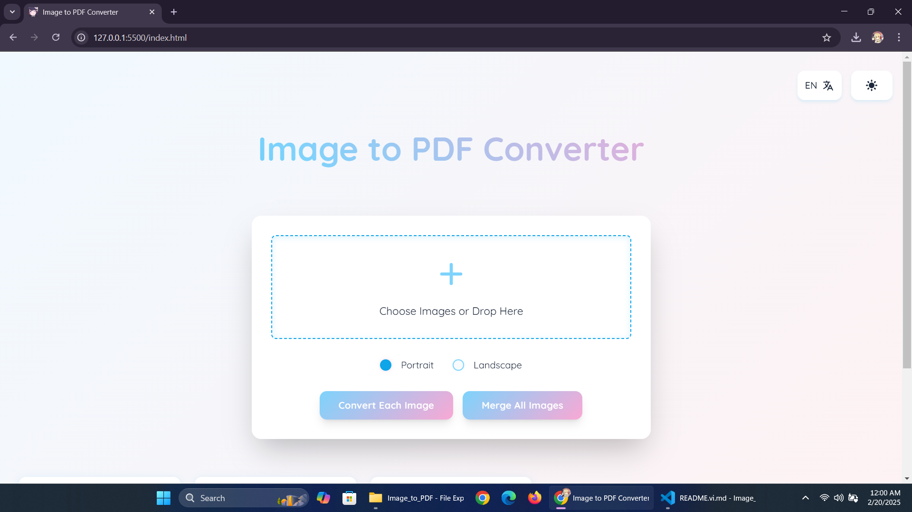

# Chuyển Đổi Ảnh Sang PDF

Ứng dụng web hiện đại chuyển đổi hình ảnh sang file PDF với giao diện glass-morphism đẹp mắt. Được xây dựng bằng HTML, CSS, JavaScript thuần và sử dụng Tailwind CSS cho phần style.

[Demo Trực Tiếp](https://teosushi1014.github.io/image-to-pdf) | [English](./README.md) | [Tiếng Việt](./README.vi.md)

## Xem Trước




## Tính Năng

- 🖼️ Chuyển đổi một hoặc nhiều ảnh sang PDF
- 📄 Hỗ trợ cả định dạng dọc và ngang
- 🌓 Hỗ trợ chế độ tối/sáng
- 🌐 Hỗ trợ đa ngôn ngữ (Tiếng Anh/Việt)
- 💫 Hiệu ứng mượt mà và thiết kế glass-morphism hiện đại
- 📱 Tương thích hoàn toàn trên mọi thiết bị
- 🖱️ Hỗ trợ kéo thả file
- 🔍 Xem trước ảnh trước khi chuyển đổi

## Công Nghệ Sử Dụng

- HTML5
- CSS3 (với thiết kế Glass-morphism)
- JavaScript (ES6+)
- [Tailwind CSS](https://tailwindcss.com)
- [PDF-lib.js](https://pdf-lib.js.org)

## Bắt Đầu

1. Clone repository:
```bash
git clone https://github.com/TeoSushi1014/image-to-pdf.git
```

2. Mở `index.html` trong trình duyệt:
```bash
cd image-to-pdf
# Sử dụng bất kỳ local server nào, ví dụ:
python -m http.server 8000
```

3. Truy cập `http://localhost:8000` trong trình duyệt

## Cách Sử Dụng

1. Click vào khu vực tải lên hoặc kéo thả ảnh
2. Chọn hướng giấy (Dọc/Ngang)
3. Chọn một trong hai:
   - Chuyển từng ảnh thành các file PDF riêng
   - Gộp tất cả ảnh vào một file PDF
4. Tải xuống các file PDF đã chuyển đổi

## Đóng Góp

Chúng tôi rất hoan nghênh mọi đóng góp! Vui lòng gửi Pull Request.

1. Fork dự án
2. Tạo nhánh tính năng (`git checkout -b feature/TinhNangMoi`)
3. Commit thay đổi (`git commit -m 'Thêm tính năng mới'`)
4. Push lên nhánh (`git push origin feature/TinhNangMoi`)
5. Tạo Pull Request

## Giấy Phép

Phân phối dưới Giấy phép MIT. Xem `LICENSE` để biết thêm thông tin.

## Ghi Nhận

- Fonts từ [Google Fonts](https://fonts.google.com)
- Chuyển đổi PDF được hỗ trợ bởi [PDF-lib.js](https://pdf-lib.js.org)

## Tác Giả

- **Tèo Sushi**
- Facebook: [boboiboy.gala.7](https://facebook.com/boboiboy.gala.7)
- Email: teosushi1014@gmail.com
- GitHub: [TeoSushi1014](https://github.com/TeoSushi1014)

## Hỗ Trợ

Nếu bạn thấy dự án này hữu ích, hãy cho một ⭐️ nhé!

---
Được tạo với ❤️ bởi [Tèo Sushi](https://github.com/TeoSushi1014)
